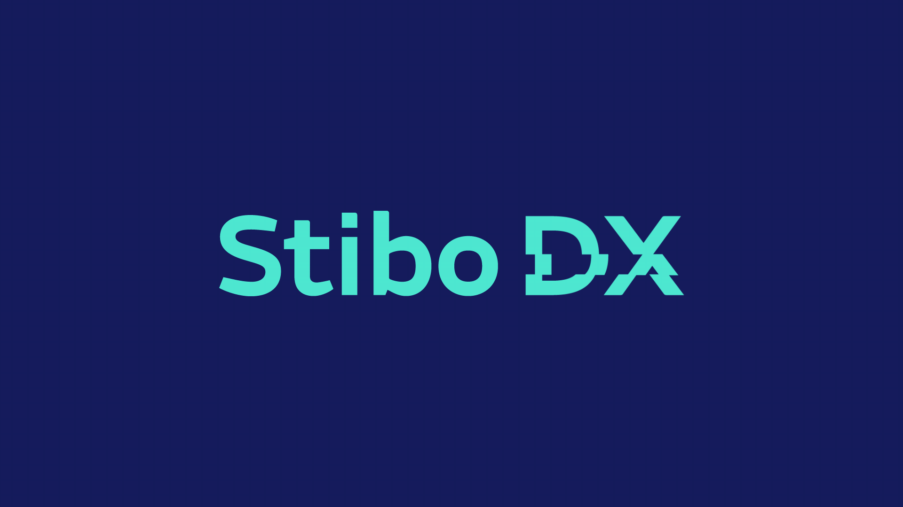

# Stibo DX

> A theme for Visual Studio Code

## Development

1. Clone the repo and open it in VS Code.
2. Press `F5` to run an extension host.
3. Edit the colours in `./stibo-dx-color-theme.js`.
4. Run `npm run build` to update `./themes/stibo-dx-color-theme.json`.
5. Commit the change.
6. Run `vsce publish <version-number>` to create a separate commit with the version bump.
